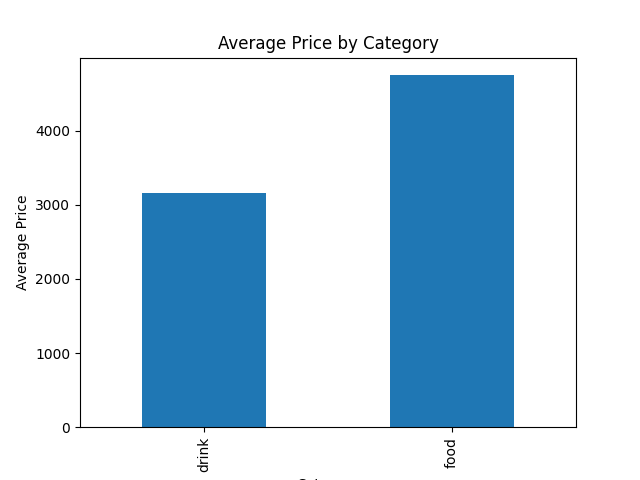

# Coffee Sales Analysis

## 📌 Overview
본 프로젝트는 카페 제품 판매 데이터를 분석하여 카테고리별 매출 실적을 비교하고 있습니다.

## 📊 Data
- category
- product
- price
- sales

## 🔍 Analysis
- 가격 × 판매량을 이용하여 총 수익 계산
- 카테고리별 평균 가격 비교
- 카테고리별 총 수익 비교
- 음료 카테고리의 평균 가격이 낮음에도 불구하고 총 수익이 더 높은 것으로 확인

## 📈 Visualization
- 카테고리별 총 수익을 비교하는 막대 그래프
- 
- 카테고리별 평균 가격을 비교하는 막대 그래프
- 

## 💡 Insight
음료 카테고리는 평균 가격은 낮지만 판매량이 많아 총 매출액이 더 높습니다.
판매량이 많은 음료와 관련된 이벤트를 활용하기 좋을것 같습니다.

## 🛠 Tools
- Python
- pandas
- matplotlib
- Jupyter Notebook
